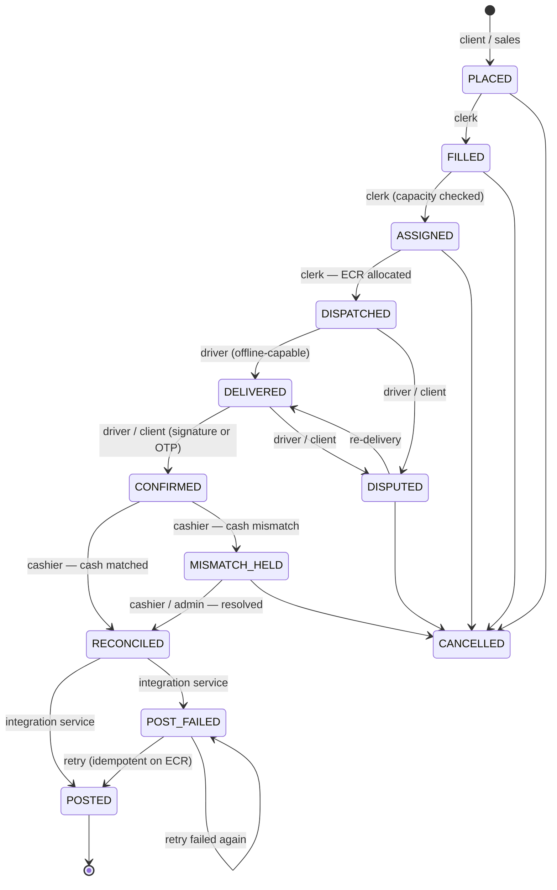

# Demo architecture — how this maps onto the production system

Companion to [`build-plan.md`](./build-plan.md). This document explains what the demo
actually is, so that the two developers building the production system can read the demo
as a specification rather than as a prototype to be thrown away, and so that nobody
mistakes a simulated boundary for a real one.

The short version: **the demo collapses the production architecture into one process, but
it does not collapse the layering.** Every rule sits where it will sit in production. The
screens call an API; they do not contain business logic.

---

## 1. The mapping

`build-plan.md` §7 describes three client apps over a REST backend, an integration service,
and Postgres. The demo preserves all five boxes — it just runs them in one browser tab.

| Production component (§7) | In the demo | Note |
|---|---|---|
| Backend REST API — auth, RBAC, Order/Delivery/Cash services | `src/core/store.ts` — the `api.*` object | Every function carries the REST route it stands for as a comment. Role is checked on entry to every mutation. |
| Order state machine (§9) | `src/core/stateMachine.ts` | An explicit transition table plus a role table. Nothing in the app assigns `order.status`. |
| ECR allocator (§4) | `src/core/ecr.ts`, called from `api.dispatchOrder` | Allocation and order persistence happen in one synchronous mutation — the demo's equivalent of a transaction. |
| Integration service — retry queue, idempotency, logging | `postToOracle` + `buildOraclePayload` in `store.ts` | Private to the module. Reachable **only** from `reconcile` and `retryPost`. No screen can call it. |
| PostgreSQL | `src/core/seed.ts` | Master data and opening transactions. `types.ts` mirrors the §8 schema table for table. |
| Back-office web app (Sales, Clerk, Cashier, Admin) | `src/apps/backoffice/` | One app, four workspaces, as §6 specifies. |
| Client/Dealer app | `src/apps/client/` | Rendered inside a phone frame. |
| Driver Tab app (offline-first) | `src/apps/driver/` | Rendered inside a tablet frame. Its offline queue is real; its transport is not. |
| Oracle APEX / ORDS | A stubbed async function with injectable failure | See §5. |

**The boundary that matters is preserved.** No client surface holds Oracle credentials or
an Oracle code path. Only the integration service posts, and only after a matched
reconciliation. That is the invariant the whole design rests on, and it is structurally
enforced here — `postToOracle` is not exported.

**The boundary that is not real** is the network. In production, `api.*` is an HTTP call
and the server re-validates everything. In the demo, `api.*` is a function call in the same
process, so "server-side enforcement" means "enforced in `store.ts`, never in a screen".
The rules are the same rules; only the wire is missing.

---

## 2. API surface → REST route → invariant

Every mutation. `RuleError` carries a `rule` tag (shown in the table) and a human-readable
message, which is what the UI surfaces in a toast when an action is refused.

### Writes

| `api.*` function | Stands for | Invariant enforced |
|---|---|---|
| `switchUser(userId)` | `POST /auth/login` | Sets the acting user. Every subsequent call is authorised against this identity and role. |
| `placeOrder({…})` | `POST /orders` | `RBAC` — client or sales only; a client may place orders **only for their own account**. `VALIDATION` — at least one line, every quantity above zero. No ECR is assigned at placement. |
| `fillOrder(id, loaded?)` | `POST /orders/:id/fill` | `RBAC` clerk only. `PLACED → FILLED` via the state machine; loaded quantities default to ordered. |
| `assignOrder(id, {vehicleId, routeId, driverId, lines?})` | `POST /orders/:id/assign` | `CAPACITY` — load already on that vehicle (`ASSIGNED` + `DISPATCHED`) plus this order's load must not exceed the vehicle class `maxCylinders`. `VALIDATION` — the assignee must actually hold the `driver` role. `FILLED → ASSIGNED`. |
| `dispatchOrder(id) → ecr` | `POST /orders/:id/dispatch` | **ECR allocated here and nowhere else**, server-side, in the same mutation as the status change. `ECR_IMMUTABLE` — an order that already carries an ECR is rejected; an ECR is never reissued. Records `dispatchedBy` for the separation-of-duties check later. |
| `cancelOrder(id, reason)` | `POST /orders/:id/cancel` | State machine only permits `CANCELLED` from `PLACED`, `FILLED`, `ASSIGNED`, `DISPUTED` and `MISMATCH_HELD` — never after a number has been consumed and delivered against. |
| `checkOutTab(deviceId, driverId)` | `POST /tabs/:id/checkout` | `RBAC` gate or driver. Rejects an out-of-service tab and one already checked out to someone else. Writes the audit row that ties a shared device to a named driver. |
| `checkInTab(deviceId)` | `POST /tabs/:id/checkin` | Closes the custody record. |
| `setOnline(bool)` | *(device state — no route)* | Simulates connectivity. Coming back online triggers a sync drain. |
| `recordDelivery({…}) → clientRef` | `POST /deliveries` | `RBAC` driver only, **and the order must be on that driver's own manifest**. Writes to the local queue first and returns immediately — never blocks on the network. The `clientRef` UUID is generated **on the device**, at the moment of the action. Records `deliveredBy`. `DISPATCHED → DELIVERED`. |
| `syncNow()` | `POST /sync/batch` | **Idempotent on `clientRef`.** A replayed action is marked synced without writing a second `delivery_event`. This is checked twice: within the batch, and against already-persisted events. |
| `requestOtp(id) → code` | `POST /orders/:id/otp` | Issues a six-digit challenge and supersedes any previous unconsumed one for that order. |
| `confirmDelivery({…})` | `POST /orders/:id/confirm` | `RBAC` driver or client. `OTP` — the code must match an unconsumed challenge, and is consumed on use. Signature path requires an actual signature payload. Appends a `confirmation_event`. `DELIVERED → CONFIRMED`. |
| `disputeDelivery(id, notes)` | `POST /orders/:id/dispute` | Appends a disputed `confirmation_event` and moves to `DISPUTED`, which cannot reach `CONFIRMED` without going back through `DELIVERED`. Nothing posts from a disputed order. |
| `reconcile({…})` | `POST /reconciliations` + `/:id/confirm` | `RBAC` cashier only. **`SOD` — the cashier must not be the user who dispatched (`dispatchedBy`) nor the user who delivered (`deliveredBy`) any order in the batch.** Cash is matched against expected within PKR 0.50; credit clients contribute zero. A match → `CONFIRMED → RECONCILED` and **this is the only call that enqueues the Oracle post**. A mismatch → `CONFIRMED → MISMATCH_HELD` and nothing posts. |
| `resolveHold(recId, notes)` | `POST /reconciliations/:id/resolve` | `RBAC` cashier or admin. Records the resolution note on the reconciliation, moves the held orders to `RECONCILED`, and only then releases the post. |
| `setOracleUp(bool)` | *(fault injection — no route)* | Demo control. Logged to the audit trail so the presenter can show it was deliberate. |
| `retryPost(orderId)` | `POST /erp-posts/:id/retry` | `RBAC` admin or cashier. Re-enters the same idempotent post path; a previously successful ECR short-circuits to the existing document number. |
| `buildOraclePayload(orderId)` | *(inspector — read-only)* | Returns the exact JSON that would be sent. Used by the admin screen to show the payload on stage. |

### Reads

All read access goes through `select.*`, which stands for the `GET` routes in §10:
`clerkQueue` → `GET /orders/queue?location=`; `driverManifest` → `GET /routes/:id/manifest`
(sorted by route stop sequence); `pendingReconciliation` → `GET /reconciliations/pending`;
`ordersForClient` → `GET /orders/mine`; `failedPosts` → `GET /erp-posts?status=failed`;
`auditForOrder` → `GET /audit/orders/:id`; `nextEcrPreview` → the live counter shown on the
dispatch screen before the number is burned.

---

## 3. Order state machine

Defined once in `src/core/stateMachine.ts` as two tables — `TRANSITIONS` (what is legal)
and `TRANSITION_ROLES` (who may drive it). `assertTransition` and `assertRole` run on every
status change. An `admin` may drive any legal edge; no role may drive an illegal one.



Plain text, for terminals without mermaid:

```
                                        clerk        clerk           clerk
  client/sales                          fill         assign          dispatch
      │                                   │            │           (ECR allocated)
      ▼                                   ▼            ▼                 │
   PLACED ─────────────► FILLED ─────► ASSIGNED ─────────────────► DISPATCHED
      │                     │              │                             │
      │                     │              │                   driver    │   driver/client
      └──────────┬──────────┴──────────────┘                     ▼       └──────► DISPUTED
                 ▼                                           DELIVERED ◄──────────────┘
             CANCELLED                                           │
                 ▲                                    driver/client: signature or OTP
                 │                                               ▼
                 │                                          CONFIRMED
                 │                                      ┌────────┴────────┐
                 │                          cashier:    │                 │   cashier:
                 │                          cash matched▼                 ▼   cash mismatch
                 │                                  RECONCILED      MISMATCH_HELD
                 └──────────────────────────────────────┤                 │
                                                        │   cashier/admin │
                        integration service ┌───────────┤◄────────────────┘
                                            ▼           ▼      (resolved)
                                      POST_FAILED ───► POSTED  (terminal)
                                            ▲   retry
                                            └── (idempotent on ECR)
```

Two things worth pointing at during a walkthrough:

- **`POST_FAILED` is a retry sub-state of `RECONCILED`, not a terminal state.** A failed
  Oracle post never loses the sale; it lands in a queue an admin can see and retry.
- **There is no edge from anywhere to `POSTED` except through `RECONCILED`.** The cash gate
  is structural, not procedural.

---

## 4. The ECR scheme

**Format: `YYLLBBNNNN` — 10 digits.**

| Segment | Digits | Meaning | Source |
|---|---|---|---|
| `YY` | 2 | Financial year. MCL's FY starts in July, so July 2026 onward is FY27. | `financialYear()` in `ecr.ts` |
| `LL` | 2 | Location (warehouse / plant) | `location.code` |
| `BB` | 2 | Book type (product category) | `book_type.code` |
| `NNNN` | 4 | Sequence, restarting per `(YY, LL, BB)` | `ecr_sequence` table |

### Worked example

A clerk at **Multan Plant** (`LL = 01`) dispatches an **Industrial Gases** order
(`BB = 01`) in **FY27**. The counter for the key `27|01|01` currently stands at 348.

```
api.dispatchOrder(orderId)
  → allocateEcr(sequences, { yy: '27', locationCode: '01', bookCode: '01' })
      reads   sequences['27|01|01'] = 348
      writes  sequences['27|01|01'] = 349        ← same mutation as the order write
      returns '27' + '01' + '01' + '0348'
  → order.ecr = 2701010348        displayed as  27 01 01 0348
```

The next Medical Gases dispatch at the same plant (`27|01|02`) is unaffected — it draws
`2701020121` from its own counter. That independence is the whole point of the scheme, and
it is also the thing that makes 4 digits safe.

### The volume finding — read this before locking the format

From [`data-profile.md`](./data-profile.md), profiling twelve real months of the Peshawar
branch ledger (Jul 2025 – Jun 2026, 9,328 sale lines):

- Peshawar issued **6,888 sale documents in the year**, peaking at **650 in October 2025**.
- **The highest real ECR observed in a single book in that year was 8,498 — 85% of the
  4-digit range consumed.** (One row shows 16,595; it is a single outlier against one
  customer among 7,182 numeric ECRs and is almost certainly a keying error. Do not size
  the sequence on it — but do not size it on the median either.)
- **Peshawar is not MCL's largest branch.**

**Recommendation, plainly:**

1. **4 digits works — but only if the sequence stays genuinely partitioned per book type.**
   Across five books, Peshawar's volume is roughly 1,400 per book per year. Comfortable.
2. **A larger branch on a shared counter would breach it.** If the app ever collapses to
   one book per location, 6,888 documents/year is already 69% of the range at Peshawar
   alone, and the observed 8,498 says the real burn rate is higher than the document count
   implies. Go to 5 digits — an 11-digit format — from day one rather than migrating a
   live key later.
3. **Add a rollover alarm at 9,000.** The allocator currently throws only at 9,999, which
   is a production outage at the dispatch counter rather than a warning. The alarm must
   reach a human weeks before the wall.
4. Filling and stock-adjustment traffic (2,000 rows, 22% of the ledger) currently shares
   the `Ecr. #` field with sales. If the app issues ECRs only on customer dispatch, the
   burn rate is about 30% below the raw row count — which is the margin the 4-digit
   decision is resting on. If that assumption changes, the decision changes with it.

Also from the profile, and relevant to the format: today's `Ecr. #` is free text, with 54
distinct non-numeric values (`FILLING`, `GAIN`, `LOSS`, `1671 AND 1672`, `315-316`). 2,146
rows are not numbers at all. The new scheme's uniqueness constraint must be on the whole
10-digit string, with a format check — that is what makes the ECR usable as a transaction
key for the first time.

---

## 5. Oracle integration contract

### The payload

`buildOraclePayload(orderId)` produces exactly this shape. It is a single combined
document — order, delivery and cash receipt in one call — rather than three sequential
calls the integration service would have to orchestrate and partially roll back. This is
the shape to take into the conversation with MCL's APEX developer.

```json
{
  "ecr": "2701010348",
  "idempotency_key": "2701010348",
  "customer_code": "119042",
  "location_code": "01",
  "doc_date": "2026-09-18T11:24:07.318Z",
  "payment_terms": "cash",
  "lines": [
    {
      "item_code": "10102",
      "qty_delivered": 6,
      "empties_returned": 6,
      "unit_price": 9520,
      "reason_code": null
    }
  ],
  "cash_receipt": { "amount": 57120, "currency": "PKR" },
  "confirmation": { "method": "signature", "ref": "RCP-000347" }
}
```

Notes on the fields:

- `idempotency_key` is the ECR, deliberately duplicated so the ORDS handler can key on one
  named field without parsing business meaning out of it.
- `doc_date` is the **delivery** timestamp where one exists, falling back to dispatch —
  the date the transaction happened in the field, not the date it reached Oracle.
- `qty_delivered` and `empties_returned` are per line. Partial delivery is normal at MCL,
  so the payload never assumes delivered equals ordered.
- `cash_receipt` is **`null` for credit clients.** Terms come from the client master, and
  `expectedCash()` returns zero for them, so a credit order reconciles at zero cash rather
  than appearing as a shortfall.
- `reason_code` must be an enum in production, not free text. The profile found the same
  concept spelled six ways in the current ledger (`FILLING` / `filling` / `FILING` /
  `FILLIGN` / `JAR FILLING` / `XL-FILLING`).

### Idempotency rule

**The ECR is the idempotency key, end to end.** Before any call, the integration service
looks for a successful `erp_post_log` row carrying that ECR:

- **Found** → the order is stamped with the existing Oracle document number, moved to
  `POSTED` if it is not already there, and **no HTTP call is made**. A retry of a
  successful post is a no-op that returns the same document number.
- **Not found** → a `pending` log row is written *before* the call, then updated with the
  response. Every attempt leaves a row, numbered; nothing is updated in place except the
  attempt's own outcome row.

Ask the APEX developer to implement the same check server-side — a unique column on the
ECR, returning the existing document number on a duplicate. Idempotency on both ends is
what makes a retry queue safe rather than a source of double-posted revenue.

### Retryable vs terminal

The response must carry an **explicit error classification field**. A retry queue that
cannot tell a lock timeout from a bad customer code will spin forever on data errors.

| Class | Examples | Handling |
|---|---|---|
| **Retryable** | ORDS unreachable, connection timeout, row lock, `5xx` | Order → `POST_FAILED`, stays in the retry queue, exponential backoff. The sale is not lost and the cash is still reconciled. |
| **Terminal** | Unknown customer code, closed accounting period, invalid item code, validation rejection | Do **not** retry. Raise to the admin queue for a human. Retrying a data error just burns attempts and hides the problem. |

In the demo, the Oracle-down toggle produces the retryable case: HTTP `503`,
`error_class: "retryable"`, order moved to `POST_FAILED`, visible in the admin failed-post
queue, and recoverable with one retry once Oracle is toggled back up. **The terminal branch
is modelled in the types (`ErpPostLog.errorClass`) but the simulated endpoint never emits
it** — that classification logic is real work, and it depends on the error codes the APEX
developer actually returns.

---

## 6. What production needs that this demo skips

Honest list. None of these are hidden in the code; they are simply absent.

| Gap | What it means |
|---|---|
| **Real authentication** | The role switcher is not auth. Production needs JWT with refresh, RBAC re-checked on every route, and per-session driver login on shared tablets — the tab check-out audit trail only has value if the login behind it is real. |
| **Persistence** | State is in memory and resets on reload. Everything in `types.ts` needs to become the Postgres schema in §8 of the build plan. |
| **Migrations** | No schema versioning, no rollback path, no seeding strategy for real master data. |
| **The ORDS contract** | The payload above is our proposal, not an agreed interface. Build-plan decision #3 — whether a REST insert replicates the APEX form's page-process logic (GL posting, stock movements, numbering) — is unanswered and is the highest-risk item in the project. Insist the endpoint wraps the same procedure the form calls. |
| **Printer SDK** | Receipt printing is a generated reference string. Real integration must be built against the hardware actually purchased, on the target Android version. |
| **SMS / OTP delivery** | Codes are shown on screen. Needs a gateway, expiry, rate limiting and delivery receipts. |
| **Push notifications** | Absent entirely. |
| **Environments** | One build. Production needs Dev, UAT pointed at Oracle's *test* workspace, and Production — with no path by which a pilot delivery can post into MCL's live books. |
| **Real concurrency** | The demo's "transaction" is a synchronous mutation in one process. Production ECR allocation needs a real row lock or sequence in Postgres; the correctness argument is the same, the mechanism is not. |
| **Secrets management** | No credentials exist here. In production, Oracle credentials and gateway keys come from a secrets manager by name — never in the repo, never in a prompt. |
| **Rollover alarm** | The ECR allocator throws at 9,999. It needs to warn at 9,000, to a human, with weeks of runway. |

---

*Read alongside [`build-plan.md`](./build-plan.md) (the production specification),
[`data-profile.md`](./data-profile.md) (what the real data says), and the root
[`README.md`](../README.md) (how to run the demo).*
